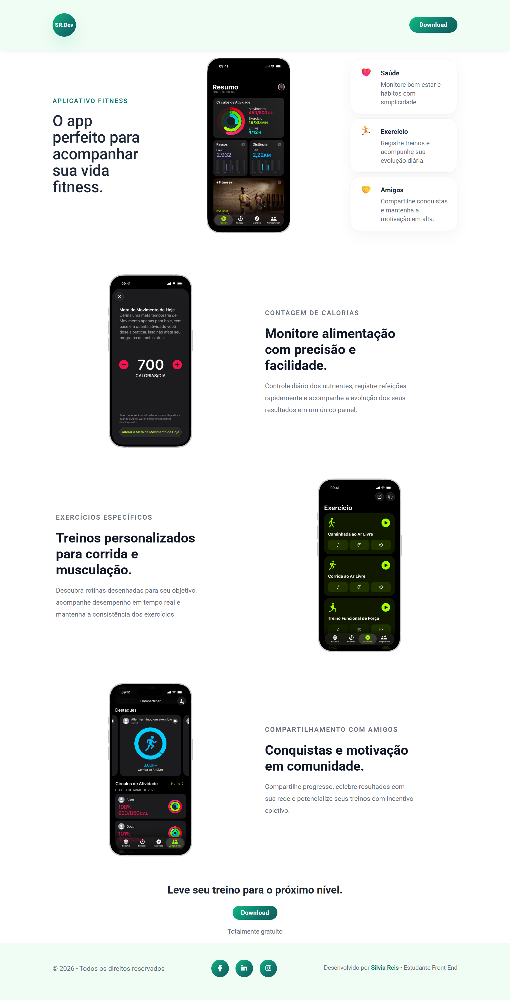

# 🏋️ SR.Dev Fitness

Uma landing page moderna e responsiva para divulgação de um aplicativo fitness focado em saúde, exercícios e interação social.

O projeto foi desenvolvido com HTML5 e CSS3, aplicando boas práticas de responsividade, hierarquia visual e identidade visual voltada para bem-estar e saúde.

---

## 📸 Preview

> Adicione aqui uma captura de tela do projeto.

```html

```

---

## 🚀 Badges


---

## 📑 Sumário

* Sobre o projeto
* Funcionalidades
* Tecnologias
* Estrutura do projeto
* Instalação
* Responsividade
* Autor

---

## 📖 Sobre o Projeto

O SR.Dev Fitness foi criado para apresentar um aplicativo voltado ao acompanhamento da vida fitness dos usuários.

A landing page destaca os principais benefícios da plataforma:

* ❤️ Saúde
* 🏃 Exercícios
* 🤝 Comunidade

Além disso, apresenta funcionalidades específicas por meio de capturas de tela do aplicativo, incentivando o download do produto.

---

## ✨ Funcionalidades

* Layout moderno e minimalista
* Hero section com destaque para o aplicativo
* Cards de benefícios
* Seções de funcionalidades
* Call To Action (CTA)
* Footer com redes sociais
* Identidade visual inspirada em saúde e bem-estar
* Responsividade para diferentes dispositivos

---

## 🛠 Tecnologias Utilizadas

* HTML5
* CSS3
* Flexbox
* CSS Grid
* Media Queries
* Google Fonts

---

## 📂 Estrutura do Projeto

```text
SR.Dev-Fitness/
│
├── index.html
├── style.css
│
├── images/
│   ├── print_1.png
│   ├── print_2.png
│   ├── print_3.png
│   ├── print_4.png
│
└── README.md
```

---

## ⚙️ Instalação

Clone o repositório:

```bash
git clone https://github.com/Silviareis1/landing-page-fitness.git
```

Entre na pasta:

```bash
cd landing-page-fitness
```

Abra o arquivo:

```bash
index.html
```

ou utilize a extensão Live Server do VS Code.

---

## 📱 Responsividade

O projeto foi otimizado para:

* 📱 Celulares pequenos (320px+)
* 📱 Celulares médios (375px+)
* 📱 Celulares grandes (425px+)
* 📲 Tablets (768px+)
* 💻 Desktop (1024px+)
* 🖥️ Telas maiores (1440px+)

---

## 🎨 Identidade Visual

A identidade visual foi inspirada em conceitos de:

* Saúde
* Bem-estar
* Movimento
* Tecnologia

Paleta principal:

* Verde Esmeralda
* Azul Petróleo
* Branco
* Tons neutros de cinza

---

## 👩‍💻 Autor

Desenvolvido por **Silvia Reis**

Estudante de Desenvolvimento Front-End

GitHub:

https://github.com/Silviareis1

---

## 📄 Licença

Este projeto foi desenvolvido para fins educacionais e de portfólio.
